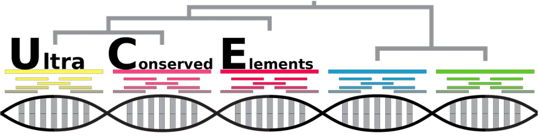
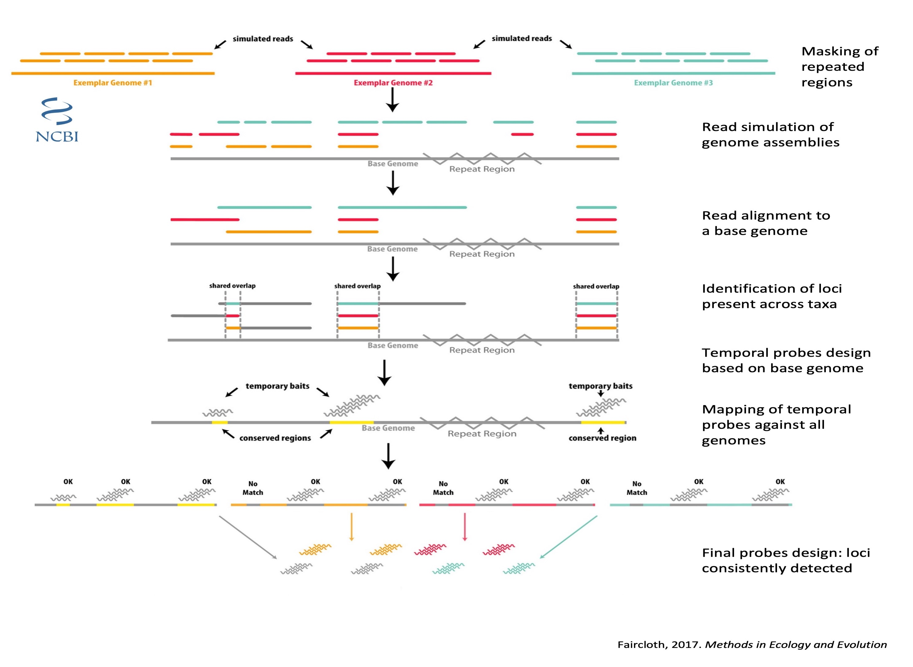
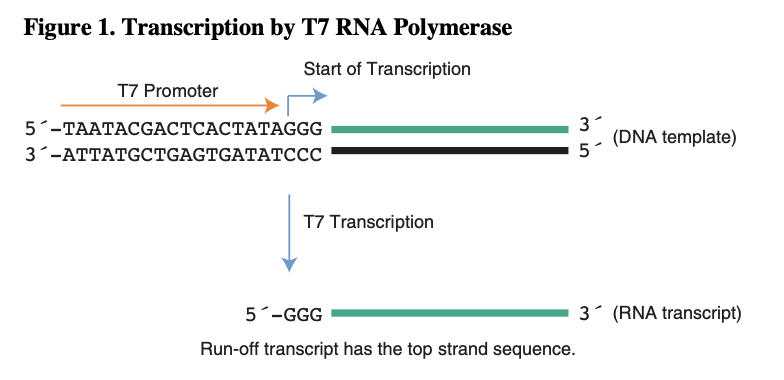

# Application of PHYLUCE pipeline on Orthoptera

/data/work/Ortho_SwissBol/UCE_genomes/Repeat_masker

We aim at identifying UltraConserved Elements (UCE) within the Orthoptera order applying the [PHYLUCE](https://phyluce.readthedocs.io/en/latest/tutorials/tutorial-4.html), which consists in genome alignment and delimitation of preserved regions among species. To date, this pipeline has not been implemented in Orthoptera. 

We will specially target those UCE having a known fonction. Given that UCE are expected to include exons and the little number of genomes published compared to the numerous transcriptomes (65), the later will be added to the UCE alignments to increase the diversity represented by our dataset.  Finally, we will produce baits targeting those UltraConserved Elements.

Figure 2. Phylogenetic distribution (Song et al., 2020) of the genome (red asterisk) and transcriptomes (black asterisk) assemblies available at NCBI and considered for the UCEs and USCOs design.

---

## Avalaible genomes and data preparation

There are nine Orthoptera genomes published (14.10.2021).

| Species | Suborder | GenBank assembly accession |  Scaffolds | Contigs | N50 | L50 | Lenght MB |
| :------------- | :------- | :------- | :----------: |  :----------: | :----------: |:----------: |:----------: |
| [*Acheta domesticus*](https://www.ncbi.nlm.nih.gov/genome/?term=txid6997[orgn]) | Ensifera | 	GCA_014858955.1 |  709 385 | 709 385 | 1 566 | 177 245 | 929 |
| [*Apteronemobius asahinai*](https://www.ncbi.nlm.nih.gov/genome/?term=txid746126[orgn]) | Ensifera | 	GCA_019974035.1 | 151 060 | 187 006 | 26 422 | 17 067 | 1 676 |
| [*Gryllus bimaculatus*](https://www.ncbi.nlm.nih.gov/genome/?term=txid6999[orgn]) |  Ensifera |	GCA_017312745.1 |  47 877 | 133 052 | 33 340 | 13 212 | 1 658 |
| [*Laupala kohalensis*](https://www.ncbi.nlm.nih.gov/genome/?term=txid109027[orgn])| Ensifera |GCA_002313205.1 |  148 784 | 216 779 | 45 047 | 9 547 | 1 595 |
| [*Locusta migratoria*](https://www.ncbi.nlm.nih.gov/genome/10772) | Caelifera |GCA_000516895.1 | 1 397 492 | 1 397 492 | 9 587	| 174 483 |	5 759 |
| *Locusta migratoria* | Caelifera |ik5 | 90.6% | 254 516 | - | 729 660 | - | 6 476 |
| [*Teleogryllus occipitalis*](https://www.ncbi.nlm.nih.gov/genome/?term=txid431949[orgn]) | Ensifera | GCA_011170035.1 |  19 866	| 21 034 | 197 533 | 2 569	| 1 933|
| [*Vandiemenella viatica*](https://www.ncbi.nlm.nih.gov/genome/?term=txid431949[orgn]) | Caelifera |	GCA_019457785.1 | 208 201 | 329 565 | 28 014 | 33 519 | 3 905 |
| [*Xenocatantops brachycerus*](https://www.ncbi.nlm.nih.gov/genome/?term=txid227619[orgn]) | Caelifera | GCA_900249655.1   | 	43 187 | 43 187	| 1 799	| 6 904	| 41,64|

The genome of *Locusta migratoria* from the NCBI was not included in our analyses due to its low assembly quality and replaced by its equivalent from the ik5 website. We used the genome of *Teleogryllus occipitalis* as base genome for the analysis.
The genomes of *Acheta domesticus* and *Apteronemobius asahinai* were also depreciated, not enough quality.

We included an outgroup of the Blattodea order. After comparison of the available genomes, *Coptotermes formosanus* was considered to be the best assembled and subsecuently included in our analysis.

|Species | Scaffolds | Contigs | N50 | L50 | Lenght MB |
| :------------- |  :----------: | :----------: | :----------: |:----------: |:----------: |
|*Coptotermes formosanus*|	 12 995 | 21 729 | 159 729 | 1 481 | 875 |
|*Cryptotermes secundus* |  55 483 | 89 199 | 63 940 | 4 518 | 1 018 |
|*Periplaneta americana* | 18 601 | 122 589 | 50 814 | 17 827 | 3 374 |
|*Zootermopsis nevadensis* |  31 663 | 64 772 | 22 794 | 5 972 | 485 |

Eventually, we realized Coptoptermes is not a good outgroup, because many contigs are sequences repeated. We found a new one of the order Phasmatodea:

| sp                                | Lenght MB | contigs | N50   |
|-----------------------------------|-------------|---------|-------|
| *Timema podura*                     | 1105        | 901128  | 3875  |
| *Timema poppensis*                  | 1137        | 596691  | 12322 |
| *Timema californicum*               | 1220        | 689529  | 17799 |
| *Timema bartmani*                   | 1108        | 370523  | 21089 |
| *Timema douglasi*                  | 1123        | 349225  | 25777 |
| *Timema shepardi*                   | 1153        | 348856  | 26252 |
| *Timema tahoe*                      | 1093        | 214394  | 28042 |
|        *Timema   genevievae*        | 1049        | 184368  | 33483 |
| [***Timema monikensis***](https://www.ncbi.nlm.nih.gov/genome/82511?genome_assembly_id=609578)                 | 1098        | 223245  | 34552 |
|        *Medauroidea   extradentata* | 2593        | 167455  | 28251 |
| *Clitarchus hookeri*                | 3802        | 906073  | 46246 |
| *Dryococelus australis*             | 3416        | 357088  | 17257 |
| *Timema cristinae*                  | 999         | NA      | NA    |

Firstly, we dowloaded the genomes from the NCBI and ik5 website and cleaned up the descriptions of the NCBI genomes. **script_1_cleaning_download_genomes.py**

Secondly, the repeated regions were hided using [RepeatMasker](https://www.repeatmasker.org/), a program which screens DNA sequences for interspersed repeats and low complexity DNA sequences. The table below summarizes the percentage of N found in the raw genomes and after running RepeatMasker.  **script_2_repeatmarker.sh**

Then, We run [BUSCO](https://busco.ezlab.org/) to determine the content in single-copy orthologs and assses the integrity of the genomes. **script_busco.sh**

| Assembly       | Raw     | RepeatMasker     | Complete USCO Insecta (1367) |
| :------------- | :----------: | :----------: | :----------: |
| Ache_do | 0 | 2,47    | 48.5% |
| Apte_asa | 0,2 | 3,44 | - |
| Copto_for  | 2,73 | 4,84 | 98.8% |
| Gri_bi | 3,4| 7,04| 97.2% |
| Laupa_ko  | 1,98 | 3,46 | 98.1% |
| Locus_mi - NCBI  | 0 | - |- |
| Locus_mi - ik5  | 11.70 | 12.84 |  90.6% |
| Teleo_oc  | 0 | 4,07 |95.9% |
| Time_mo | 0,89% | 3,76%| 94.6% |
| Vandi_vi | 8,07 | 9,07 | 88.2% | 
| Xeno_bra  | 0 | 1,78 | 85.4% |

We keep only 3 Ensifera, 3 Caelifera and the Phasmatodea outgroup: 
Gri_bi 
Laupa_ko 
Locus_mi (ik5) 
Teleo_oc 
Time_mo (outgroup) 
Vandi_vi 
Xeno_bra

Ee simulated reads usin [art](https://www.niehs.nih.gov/research/resources/software/biostatistics/art/) which will be subsequently mapped agains the base genome. **script_3_simulate_reads.sh**

## First mapping 

The base genome needed to be indexed before using it as mapping reference. **script_4_base.sh**

After that, the simulated reads of the 6 Orthoptera genomes and the Phasmatodea
were mapped against the base taxon on a taxon-by-taxon basis using stampy. **script_5_first_alignment**

The unmapped reads were removed  **script_6_bam**. The BAM files were converted to BED format (interval-based format) and sorted, merged the overlapping regions and removed the repetitive intervals.  **script_7_bed** 

At this point, we determined which alignment intervals were shared among all genomes, at leats, 5 out of the 7 taxa, including the output. Using the base genome, we design a temporary probe set from those shared regions. **script_8_locus_pres.sh**
21 578 loci were identified in this first screening.

## Temporary baits mapping 
The temporary baits set was aligned against each genome and the regions around they mapped we extracted. **script_9_baits_mapping.sh** We could then find how many loci we detected consistently across genomes. **script_10_loci_pres2.sh**
We found the 5 715 loci shared between 5 out of the 7 Orthoptera genomes, with a stringency of 0.7. 

## Bait set design and UCE aligment

The final bait set capturing the 5 715 UCE identified were used to design a new bait set composed of sequences of all genomes  **script_11_final_baits_design**, 64 519 probes. This bait set is considered to be the final output of the pipeline, but for the multi-locus barcode we need to asses other characteristic of the UCE. To that end we performed an insilico capture **script_12_mapping_insilico** and alignmed the UCE sequences **script_13_obtain_UCE**. Only 1 843 were captured.

## UCE filtering and T7

We selected only those UCE having captured 6 or 7 genomes, with a minimum lenght of 120 pb and with a maximum percentage of variable sites of 50. 290 UCE were selected. **script_14_filter.sh**
Addtion of T7 promoter ( CCCTATAGTGAGTCGTATTA ) at the 3' end. **script_addT7.sh**

### Depreciated

The 3 416 probes capturing those UCE were mapped against the 65 transcriptomes available. The mapped only in 35 transcriptomes.

Loci shared by 0 taxa:	289.0
Loci shared by 1 taxa:	289.0
Loci shared by 2 taxa:	288.0
Loci shared by 3 taxa:	288.0
Loci shared by 4 taxa:	287.0
Loci shared by 5 taxa:	284.0
Loci shared by 6 taxa:	282.0
Loci shared by 7 taxa:	280.0
Loci shared by 8 taxa:	272.0
Loci shared by 9 taxa:	266.0
Loci shared by 10 taxa:	257.0
Loci shared by 11 taxa:	247.0
Loci shared by 12 taxa:	235.0
Loci shared by 13 taxa:	220.0
Loci shared by 14 taxa:	206.0
Loci shared by 15 taxa:	194.0
Loci shared by 16 taxa:	182.0
Loci shared by 17 taxa:	165.0
Loci shared by 18 taxa:	144.0
Loci shared by 19 taxa:	122.0
Loci shared by 20 taxa:	89.0
Loci shared by 21 taxa:	73.0
Loci shared by 22 taxa:	59.0
Loci shared by 23 taxa:	49.0
Loci shared by 24 taxa:	40.0
Loci shared by 25 taxa:	32.0
Loci shared by 26 taxa:	20.0
Loci shared by 27 taxa:	13.0
Loci shared by 28 taxa:	10.0
Loci shared by 29 taxa:	3.0
Loci shared by 30 taxa:	1.0
Loci shared by 31 taxa:	0.0
Loci shared by 32 taxa:	0.0
Loci shared by 33 taxa:	0.0

Depreciated because at all map against at least one, but in which one?

| Genus           | Species epithet  | Family            | NCBI BioProject Accession |
| :--------------- | :---------------- | :----------------- | -------------------------: |
| Dianemobius     | nigrofasciatus   | Gryllidae         | PRJNA286330               |
| Ceuthophilus    | sp.              | Gryllidae         | PRJNA557437               |
| Gryllotalpa     | sp.              | Acrididae         | PRJNA597605               |
| Prosarthria     | teretrirostris   | Acrididae         | PRJNA598230               |
| Stenobothrus    | lineatus         | Acrididae         | PRJNA598229               |
| Tetrix          | subulata         | Anostostomatidae  | PRJNA286341               |
| Mecopoda        | elongata         | Acrididae         | PRJNA598232               |
| Aularches       | miliaris         | Pyrgomorphidae    | PRJNA286343               |
| Comicus         | calcaris         | Pyrgomorphidae    | PRJNA273022               |
| Tachycines      | asynamora        | Acrididae         | PRJNA543568               |
| Nippancistroger | testaceus        | Rhaphidophoridae  | PRJNA219538               |
| Phaeophilacris  | bredoides        | Acrididae         | PRJNA598233               |
| Tropidacris     | collaris         | Schizodactyloidea | PRJNA273028               |
| Xya             | variegata        | Prophalangopsidae | PRJNA286355               |
| Acheta          | domesticus       | Trigonidiidae     | PRJDB5888                 |
| Anostostoma     | australasiae     | Pyrgomorphidae    | PRJNA286359               |
| Atractomorpha   | sp.              | Pyrgomorphidae    | PRJNA286360               |
| Cyphoderris     | sp.              | Tettigoniidae     | PRJNA352290               |
| Dictyophorus    | griseus          | Gryllotalpidae    | PRJNA219562               |
| Dictyophorus    | spumans          | Gryllidae         | PRJNA376023               |
| Haplotropis     | brunneriana      | Pamphagidae       | PRJNA286385               |
| Hemiandrus      | sp.              | Anostostomatidae  | PRJNA286387               |
| Hemideina       | thoracica        | Anostostomatidae  | PRJNA286388               |
| Monistria       | consobrina       | Gryllidae         | PRJNA429662               |
| Monistria       | discrepans       | Tettigoniidae     | PRJNA272195               |
| Myrmecophilus   | sp.              | Acrididae         | PRJNA598227               |
| Neonetus        | sp.              | Pyrgomorphidae    | PRJNA286408               |
| Omura           | congrua          | Pyrgomorphidae    | PRJNA286409               |
| Parapetasia     | femorata         | Myrmecophilidae   | PRJNA286410               |
| Phaneroptera    | falcata          | Rhaphidophoridae  | PRJNA286412               |
| Phymateus       | viridipes        | Gryllacrididae    | PRJNA273043               |
| Pielomastax     | soochowensis     | Pyrgomorphidae    | PRJNA286418               |
| Poekilocerus    | pictus           | Pyrgomorphidae    | PRJNA286429               |
| Propsednura     | eyrei            | Phalangopsidae    | PRJNA273046               |
| Psedna          | nana             | Tettigoniidae     | PRJNA286433               |
| Stenoscepa      | sp.              | Pyrgomorphidae    | PRJNA286436               |
| Stenopelmatus   | sp.              | Episactidae       | PRJNA286437               |
| Systella        | rafflesii        | Pyrgomorphidae    | PRJNA286438               |
| Xya             | japonica         | Pyrgomorphidae    | PRJNA286441               |
| Zonocerus       | variegatus       | Proscopiidae      | PRJNA219598               |
| Zubovskya       | sp.              | Pyrgomorphidae    | PRJNA286442               |
| Zonocerus       | elegans          | Acrididae         | PRJNA598226               |
| Gampsocleis     | gratiosa         | Acrididae         | PRJNA633949               |
| Gryllus         | bimaculatus      | Acrididae         | PRJNA633949               |
| Laupala         | cerasina         | Acrididae         | PRJNA524786               |
| Schistocerca    | gregaria         | Acrididae         | PRJNA633949               |
| Ceracris        | nigricornis      | Acrididae         | PRJNA633949               |
| Acheta          | domesticus       | Acrididae         | PRJNA633949               |
| Acrolophitus    | hirtipes         | Acrididae         | PRJNA633949               |
| Schistocerca    | americana        | Acrididae         | PRJNA633949               |
| Melanoplus      | confusus         | Acrididae         | PRJNA633949               |
| Stenacris       | vitreipennis     | Acrididae         | PRJNA219602               |
| Amblytropidia   | mysteca          | Stenopelmatidae   | PRJNA286459               |
| Aidemona        | azteca           | Pyrgomorphidae    | PRJNA286458               |
| Trimerotropis   | pallidipennis    | Acrididae         | PRJNA598228               |
| Arphia          | xanthoptera      | Trigonopterygidae | PRJNA286463               |
| Chortophaga     | viridifasciata   | Rhaphidophoridae  | PRJNA273032               |
| Schistocerca    | nitens           | Tetrigidae        | PRJNA219606               |
| Schistocerca    | nitens           | Acrididae         | PRJNA598231               |
| Schistocerca    | americana        | Romaleidae        | PRJNA273061               |
| Schistocerca    | serialis cubense | Tridactylidae     | PRJNA286474               |
| Schistocerca    | serialis cubense | Tridactylidae     | PRJNA273062               |
| Schistocerca    | americana        | Pyrgomorphidae    | PRJNA286665               |
| Schistocerca    | piceifrons       | Pyrgomorphidae    | PRJNA286476               |
| Schistocerca    | piceifrons       | Acrididae         | PRJNA286477               |

