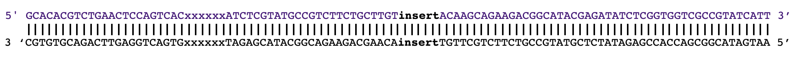

# rDNA probes

Given that no complete ribosomal sequence was available at the NCBI for Orthoptera, we amplified the complete ribosomal DNA of 35 Orthoptera using the eurakaryote conserved primers  [CHIR_18S_F4 (GGCTACCACATCYAARGAAGGCAGCAG) and CHIR_28S_R8(TCGGCAGGTGAGTYGTTRCACAYTCCT)](https://academic.oup.com/gigascience/article/8/5/giz006/5368330). The primers were designed using alignments of partial 18S and 28S sequences of ∼1,000 species of eukaryotes, with a focus on animals, they target highly conserved regions.

The 16 samples which amplified correctly according to the FA results were sequenced using a R9.4.1 MinION flowcell. We designed a AmpliconSEQ protocol to add our own ILLPCR2_X barcodes and the Oxford Nanopore adapters for sequencing. We performed a first sequencing test with 4 samples and we sequenced the remaining 12 subsequently.

xxxxxx corresponds to the 6 bp barcode

**5'3' chain of the amplicon**

5' GCACACGTCTGAACTCCAGTCACxxxxxxATCTCGTATGCCGTCTTCTGCTTGT insert ACAAGCAGAAGACGGCATACGAGATATCTCGGTGGTCGCCGTATCATT 3'

Sequencing will provide the reverse complementary of the chain:

5' AATGATACGGCGACCACCGAGATATCTCGTATGCCGTCTTCTGCTTGT insert ACAAGCAGAAGACGGCATACGAGATxxxxxxGTGACTGGAGTTCAGACGTGTGC 3'

**3'5' chain of the amplicon**

3 ‘CGTGTGCAGACTTGAGGTCAGTGxxxxxxTAGAGCATACGGCAGAAGACGAACA insert TGTTCGTCTTCTGCCGTATGCTCTATAGAGCCACCAGCGGCATAGTAA 5’

=

5' AATGATACGGCGACCACCGAGATATCTCGTATGCCGTCTTCTGCTTGT insert ACAAGCAGAAGACGGCATACGAGATxxxxxxGTGACTGGAGTTCAGACGTGTGC 3'

Sequencing will provide the reverse complementary of the chain:

5' GCACACGTCTGAACTCCAGTCACxxxxxxATCTCGTATGCCGTCTTCTGCTTGT insert ACAAGCAGAAGACGGCATACGAGATATCTCGTGGTCGCCGTATCATT 3'
 
---

## Basecalling

After sequencing  using a MinION device at the Natural History Museum of Geneva, we perform the basecalling using Guppy. **script_guppy.sh**

The total number of reads sequenced was 2 476 456. 435 857 in the fist run of 3 samples (asterisk in Table 1) and 2 323 937 in the second run of 13 samples.

## Demultiplexing

Given that the sequence GCACACGTCTGAACTCCAGTCAC was not complete in every sample, we demultiplexed using only xxxxxxATCTCGTATGCCGTCTTCTGCTTGT using [cutadapt](https://cutadapt.readthedocs.io/en/stable/guide.html).
The barcodes to eliminate in the reads are the reverse complementary of the sequence stated in the oligo tubes. **script_cutadapt**

We run a quality control using fastqc **script_fastqc** to determine whether some technical sequeces remained after demultiplexing. After demultiplexing 60,1% of reads are kept.

## Removal of contaminants and assembly

For the samples with no assigned rDNA assembly :

1. Blast of reads of the against the rDNA sequence of Vandi_vi reference genome.
2. Removal of non-orthoptera sequences according to legnth (700, 1000, 1500) and % of similarity (75, 80, 85). **script_loop_blast_canu_improving.sh**
3. Assembly with [Canu](https://canu.readthedocs.io/en/latest/parameter-reference.html#global-options) 
4. Validation that they belong to Orthoptera. Sequences were BLASTed against the rNCBI database and a phylogenetic tree was infered.

**script_loop_blast_canu_improving.sh** **script_blast_canu.sh**

## Probes desing

The sequences were cut into 130 bp probes using BaitDesigner. The program doesn't output the tailing probe, so it was extracted using seqkit subseq.
The T7 promoter was added at the 3' end to every probe.

## Results

Table 1.
|    Sample    | Suborder |          Family          |                 Species                 |  Demultiplexed reads  | Assembly |
|:------------:|:--------:|:------------------------:|:---------------------------------------:|:---------------------:|:--------:|
|   Sample 1   |     E    |       Tettigoniidae      |           *Rhacocleis annulata*         |        139 039        |          |
|   Sample 10  |     C    |         Acrididae        |  *Odontopodisma   decipiens insubrica * |         30 562        |          |
|   Sample 14  |     C    |       Tridactylidae      |             *Xya variegata*             |         73 707        |          |
|   Sample 17  |     E    |       Tettigoniidae      |           *Anonconotus alpinus*         |         54 600        |     Y    |
|  Sample 19*  |     C    |         Acrididae        |            *Oedaleus decorus *          |         27 998        |     Y    |
|  Sample 20*  |     E    |       Tettigoniidae      |         *Meconema thalassinum*          |         50 382        |     Y    |
|   Sample 21  |     E    |         Gryllidae        |           *Gryllus campestris*          |        572 748        |     Y    |
|   Sample 22  |     E    |       Trigonidiidae      |       *Pteronemobius lineolatus*        |         58 948        |     Y    |
|   Sample 25  |     C    |         Acrididae        |       *Myrmeleotettix   maculatus*      |         34 818        |          |
|   Sample 27  |     C    |         Acrididae        |        *Epacromius   tergestinus*       |        224 075        |     Y    |
|   Sample 28  |     E    |        Rhaphidophoridae  |          *Troglophilus cavicola*        |         45 671        |     Y    |
|   Sample 29  |     C    |         Acrididae        |          *Aiolopus   strepens*          |         43 814        |     Y    |
|   Sample 3   |     C    |        Tetrigidae        |       *Uvarovitettix   depressus*       |         46 205        |          |
|   Sample 30  |     E    |       Tettigoniidae      |         *Conocephalus   fuscus*         |         29 180        |     Y    |
|   Sample 34  |     C    |         Acrididae        |          *Podismopsis   keisti*         |         22 799        |     Y    |
|  Sample 35*  |     E    |       Tettigoniidae      |        *Leptophyes   albovittata*       |         51 059        |     Y    |
|     TOTAL    |          |                          |                                         |       1 505 605       |          |

Contigs for 11/16
In the cases were no sequence belonging to the correct samples was obtained, we only obtained contaminant of assemblies for other individuals. Those uncorrectly assigned contigs were assembled using only 20 reads. More likely it is due to % of uncorrectly demultiplexed reads than cotaminants. 

## Ribosomal DNA of the reference genomes

We extracted the rDNA of 6 genomes used for the UCE and USCO identification by BLASTing the few available rDNA sequencenes.

Table 2.
| Reference   genome | Suborder |               Species              | Complete rDNA seq. |    18S   |   5.8S   |   28S   |
|:------------------:|:--------:|:----------------------------------:|:------------------:|:--------:|:--------:|:-------:|
| Vandi_vi           | C        |        *Vandiemenella viatica*     | Y                  |          |          |         |
| Locus mi           | C        |        *Locusta migratoria*        |                    | partial  | complete | partial |
| Xeno_bra           | C        |        *Xenocatantops brachycerus* | Y                  |          |          |         |
| Laupa_ko           | E        | *Laupala kohalensis*               |                    | complete |          | partial |
| Gri_bi             | E        |        *Gryllus bimaculatus*       |                    | complete |          | partial |
| Teleo_oc           | E        |        *Teleogryllus occipitalis*  |                    | complete | complete | partial |

Only the sequences of *Vandiemenella viatica* and *Xenocatantops brachycerus* were kept.