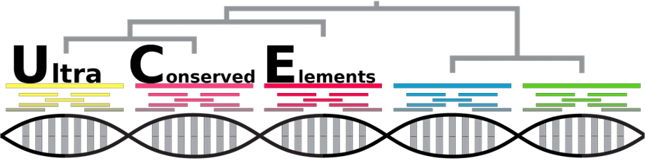
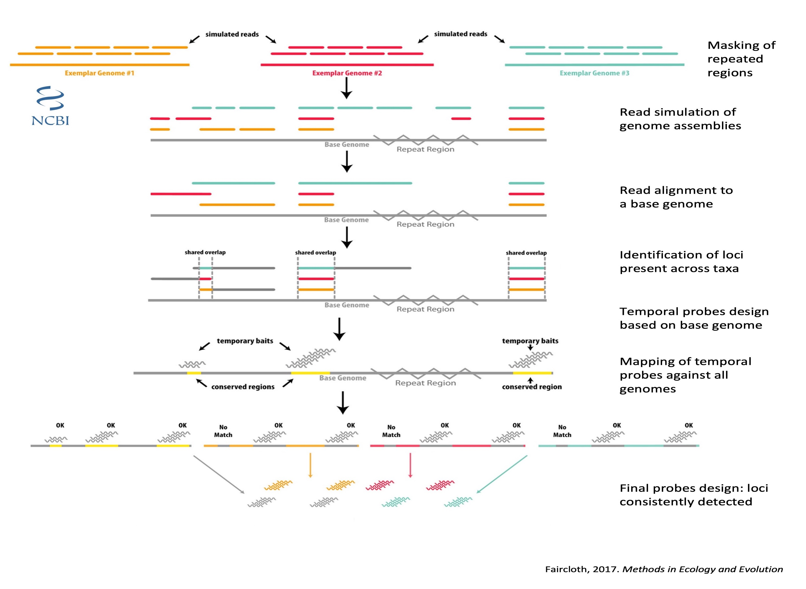
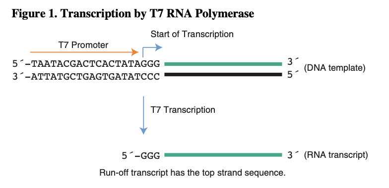

# Application of PHYLUCE pipeline in Orthoptera

We aim at identifying UltraConserved Elements (UCE) within the Orthoptera order applying the [PHYLUCE pipeline](https://phyluce.readthedocs.io/en/latest/tutorials/tutorial-4.html), which consists in genome alignment and delimitation of preserved regions among species. To date, this pipeline has not been implemented in Orthoptera. 

Figure 2. Phylogenetic distribution (Song et al., 2020) of the genome (red asterisk) assemblies available at NCBI and considered for the UCEs and USCOs design. Black asterisk indicate transcriptomes (not included in the analysis)

---

## Avalaible genomes and data preparation

There are nine Orthoptera genomes published (14.10.2021).

| Species | Suborder | GenBank assembly accession |  Scaffolds | Contigs | N50 | L50 | Lenght MB |
| :------------- | :------- | :------- | :----------: |  :----------: | :----------: |:----------: |:----------: |
| [*Acheta domesticus*](https://www.ncbi.nlm.nih.gov/genome/?term=txid6997[orgn]) | Ensifera | 	GCA_014858955.1 |  709 385 | 709 385 | 1 566 | 177 245 | 929 |
| [*Apteronemobius asahinai*](https://www.ncbi.nlm.nih.gov/genome/?term=txid746126[orgn]) | Ensifera | 	GCA_019974035.1 | 151 060 | 187 006 | 26 422 | 17 067 | 1 676 |
| [*Gryllus bimaculatus*](https://www.ncbi.nlm.nih.gov/genome/?term=txid6999[orgn]) |  Ensifera |	GCA_017312745.1 |  47 877 | 133 052 | 33 340 | 13 212 | 1 658 |
| [*Laupala kohalensis*](https://www.ncbi.nlm.nih.gov/genome/?term=txid109027[orgn])| Ensifera |GCA_002313205.1 |  148 784 | 216 779 | 45 047 | 9 547 | 1 595 |
| [*Locusta migratoria*](https://www.ncbi.nlm.nih.gov/genome/10772) | Caelifera |GCA_000516895.1 | 1 397 492 | 1 397 492 | 9 587	| 174 483 |	5 759 |
| *Locusta migratoria* | Caelifera |ik5 | 90.6% | 254 516 | - | 729 660 | - | 6 476 |
| [*Teleogryllus occipitalis*](https://www.ncbi.nlm.nih.gov/genome/?term=txid431949[orgn]) | Ensifera | GCA_011170035.1 |  19 866	| 21 034 | 197 533 | 2 569	| 1 933|
| [*Vandiemenella viatica*](https://www.ncbi.nlm.nih.gov/genome/?term=txid431949[orgn]) | Caelifera |	GCA_019457785.1 | 208 201 | 329 565 | 28 014 | 33 519 | 3 905 |
| [*Xenocatantops brachycerus*](https://www.ncbi.nlm.nih.gov/genome/?term=txid227619[orgn]) | Caelifera | GCA_900249655.1   | 	43 187 | 43 187	| 1 799	| 6 904	| 41,64|

The genome of *Locusta migratoria* from the NCBI was not included in our analyses due to its low assembly quality and replaced by its equivalent from the ik5 website. We used the genome of *Teleogryllus occipitalis* as base genome for the analysis.
The genomes of *Acheta domesticus* and *Apteronemobius asahinai* were also depreciated, not enough quality.

We included an outgroup of the Phasmatodea order. After comparison of the available genomes, *Timema monikensis* was considered to be the best assembled and subsecuently included in our analysis.

| sp                                | Lenght MB | contigs | N50   |
|-----------------------------------|-------------|---------|-------|
| *Timema podura*                     | 1105        | 901128  | 3875  |
| *Timema poppensis*                  | 1137        | 596691  | 12322 |
| *Timema californicum*               | 1220        | 689529  | 17799 |
| *Timema bartmani*                   | 1108        | 370523  | 21089 |
| *Timema douglasi*                  | 1123        | 349225  | 25777 |
| *Timema shepardi*                   | 1153        | 348856  | 26252 |
| *Timema tahoe*                      | 1093        | 214394  | 28042 |
|        *Timema   genevievae*        | 1049        | 184368  | 33483 |
| [***Timema monikensis***](https://www.ncbi.nlm.nih.gov/genome/82511?genome_assembly_id=609578)                 | 1098        | 223245  | 34552 |
|        *Medauroidea   extradentata* | 2593        | 167455  | 28251 |
| *Clitarchus hookeri*                | 3802        | 906073  | 46246 |
| *Dryococelus australis*             | 3416        | 357088  | 17257 |
| *Timema cristinae*                  | 999         | NA      | NA    |

We dowloaded the genomes from the NCBI and ik5 website and cleaned up the descriptions of the NCBI genomes. **script_1_cleaning_download_genomes.py**

Repeated regions were hiden using [RepeatMasker](https://www.repeatmasker.org/), a program which screens DNA sequences for interspersed repeats and low complexity DNA sequences. The table below summarizes the percentage of N found in the raw genomes and after running RepeatMasker.  **script_2_repeatmarker.sh**

We run [BUSCO](https://busco.ezlab.org/) to determine the content in single-copy orthologs and assses the integrity of the genomes. **script_busco.sh**

| Assembly       | %N - Raw     | %N - RepeatMasker     | Complete USCO Insecta (1367) |
| :------------- | :----------: | :----------: | :----------: |
| Ache_do | 0 | 2,47    | 48.5% |
| Apte_asa | 0,2 | 3,44 | - |
| Copto_for  | 2,73 | 4,84 | 98.8% |
| Gri_bi | 3,4| 7,04| 97.2% |
| Laupa_ko  | 1,98 | 3,46 | 98.1% |
| Locus_mi - ik5  | 11.70 | 12.84 |  90.6% |
| Teleo_oc  | 0 | 4,07 |95.9% |
| Time_mo | 0,89% | 3,76%| 94.6% |
| Vandi_vi | 8,07 | 9,07 | 88.2% | 
| Xeno_bra  | 0 | 1,78 | 85.4% |

We keep only 3 Ensifera, 3 Caelifera and the Phasmatodea outgroup: 
Gri_bi 
Laupa_ko 
Locus_mi (ik5) 
Teleo_oc (base genome)
Time_mo (outgroup) 
Vandi_vi 
Xeno_bra

Reads were simulated for each genome using [art](https://www.niehs.nih.gov/research/resources/software/biostatistics/art/). **script_3_simulate_reads.sh**

## First mapping 

The base genome was indexed before mapping. **script_4_base.sh**
The simulated reads of the 6 Orthoptera genomes and the Phasmatodea outgroup were mapped against the base genome on a taxon-by-taxon basis using stampy. **script_5_first_alignment**

The unmapped reads were removed  **script_6_bam**. The BAM files were converted to BED format (interval-based format) and sorted  to merge the overlapping regions.  **script_7_bed** 

We identified alignment intervals  shared among at leats 5 out of the 7 genomes, including the output. Using the base genome, we design a temporary probe set from those shared regions. **script_8_locus_pres.sh**
21 578 loci were identified at this point.

## Temporary baits mapping 

The temporary baits set was aligned against each genome and the regions where they mapped we extracted. **script_9_baits_mapping.sh** We identified those loci consistently detected across genomes. **script_10_loci_pres2.sh**
We found  5 715 loci shared between 5 out of the 7 Orthoptera genomes, with a stringency value of 0.7. 

## Bait set design and UCE aligment

The final bait set capturing the 5 715 UCE identified were used to design a new bait set composed of sequences of all genomes  **script_11_final_baits_design**, counting 64 519 probes. This bait set is considered to be the final output of the pipeline, but the visual inspection of the loci showed paralogy remaining 

## In silico capture

To improve the quality of the UCE set to be included in the multi-locus marker we performed an insilico capture **script_12_mapping_insilico** and aligned the UCE captured **script_13_obtain_UCE**. Only 1 843 were captured.

## UCE filtering and T7

We selected only those UCE having captured 6 or 7 genomes, to ensure enough representation if Califera an Ensifera, with a minimum lenght of 120 pb and with a maximum percentage of variable sites of 50. 290 UCE passed the filters. Finally, the T7 promoter ( CCCTATAGTGAGTCGTATTA ) was added at the 3' end. **script_14_filter_probes_multi-locus.sh**

